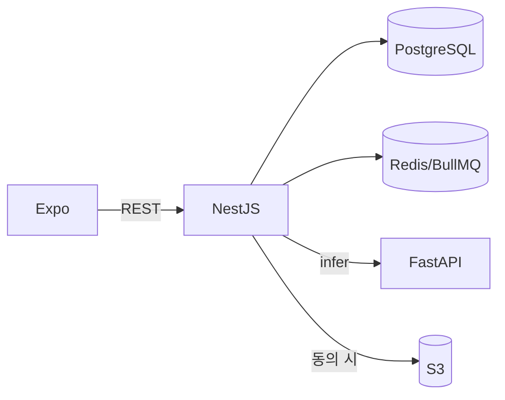

# Todayskin

날씨·대기질과 피부 이미지 분석을 결합한 Expo 앱.  
**NestJS**가 인증·동의·진단·추천·날씨·영속화, **FastAPI**는 추론 결과만 반환. 동의 이미지만 S3 저장.

| 레이어 | 스택 |
|---|---|
| 앱 | Expo SDK 54 · React Native · Expo Router |
| API | NestJS 11 · Prisma 7 · PostgreSQL · Redis · BullMQ |
| 추론 | `backend/inference-service/` FastAPI + MobileNetV3 |
| 운영 | ECS Fargate · RDS · S3 · GitHub Actions |

**상태:** BE T0~T14 · N0~N22 · N24~N34 완료 · **API freeze**. 다음 = FE ([FRONTEND_TASKS](docs/FRONTEND_TASKS.md)). 남은 BE = N16(AWS 첫 배포, 별도). EAS·구독 보류.

## 문서

- [로컬 셋업](docs/SETUP.md)
- [아키텍처](docs/ARCHITECTURE.md)
- [백엔드 실행 요약](backend/README.md) · [배포](backend/docker/DEPLOYMENT.md)
- [BE Task 이력](docs/BACKEND_TASKS.md) · [FE Task](docs/FRONTEND_TASKS.md) · [FE 핸드오프](docs/FE_HANDOFF_PROMPT.md)
- [협업](CONTRIBUTING.md)
