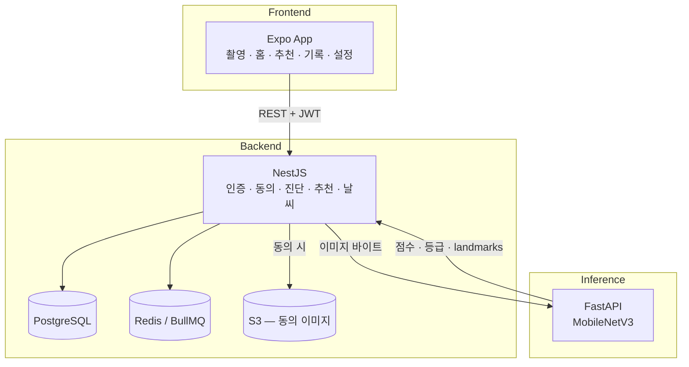

# Todayskin

날씨·대기질과 피부 이미지 분석을 결합해 피부 상태와 스킨케어 추천을 제공하는 모바일 애플리케이션.

촬영한 얼굴과 그날의 UV·미세먼지 등을 함께 보고, 실제 화장품 추천과 기록·패턴을 제공합니다.  
이 저장소는 **프론트 · 백엔드 · 프로젝트 매니저(PM)** 가 한곳에서 협업하는 모노레포입니다.

<p align="center"><b>Frontend</b></p>
<p align="center">
  <a href="https://docs.expo.dev/versions/v54.0.0/"></a>
  <a href="https://reactnative.dev/"></a>
  <a href="https://docs.expo.dev/router/introduction/"></a>
</p>
<p align="center"><b>Backend</b></p>
<p align="center">
  <a href="https://nestjs.com/"></a>
  <a href="https://www.prisma.io/"></a>
  <a href="https://www.postgresql.org/"></a>
  <a href="https://fastapi.tiangolo.com/"></a>
</p>
<p align="center">
  <a href="https://redis.io/"></a>
  <a href="https://docs.bullmq.io/"></a>
  <a href="https://aws.amazon.com/ko/fargate/"></a>
  <a href="https://github.com/features/actions"></a>
</p>

---

## 제품이 하는 일

| 영역 | 사용자 경험 |
|------|-------------|
| 온보딩 · 계정 | 전화+OTP, 카카오/구글/애플 소셜, 동의·위치 |
| 홈 · 날씨 | 현재 기상·대기질, 측정 불가 시 명시적 unavailable |
| 진단 | 카메라 가이드 → 부위별 점수 · 결과 화면 |
| 추천 · 제품 | 실제 화장품 + 구매 링크, 빠른 응답 후 AI 결과로 갱신 |
| 기록 · 패턴 | 날짜별 히스토리, 랜드마크(동의 시), 개인 패턴 |
| 설정 | 프로필 · 동의 · 알림 선호 · 탈퇴 |

> 얼굴 이미지는 **저장 동의한 경우만** 암호화 보관합니다. 미동의면 추론 후 보관하지 않습니다.

---

## 기술 스택

### Frontend (앱)

| | |
|---|---|
| 런타임 | **Expo SDK 54** · React Native 0.81 · React 19 |
| 라우팅 · UI | Expo Router 6 · Reanimated · SVG · Safe Area |
| 디바이스 | Camera · Image Picker · Location · AsyncStorage · Linking |
| 언어 | TypeScript |

경로: `app/` (화면) · `src/` (API client · 컴포넌트 · 훅 · 타입 · 테마)

### Backend (API · BFF)

| | |
|---|---|
| 서버 | **NestJS 11** Modular Monolith |
| 데이터 | **PostgreSQL** · **Prisma 7** |
| 캐시 · 큐 | **Redis** · **BullMQ** (없으면 Inline fallback) |
| 인증 | JWT access/refresh · OTP(SMS) · 소셜 토큰 검증 |
| 저장소 | **S3** (동의 이미지) · 감사·동의 게이트 |
| 관측 | Pino · Sentry · Helmet · Throttler |

경로: `backend/src/` — 구조 지도는 [`backend/README.md`](backend/README.md)

### AI (추론만)

| | |
|---|---|
| 서버 | **FastAPI** (`backend/inference-service/`) |
| 모델 | MobileNetV3 + MediaPipe landmarks |
| 경계 | 점수·등급·랜드마크만 반환 · **DB/인증/비즈니스 로직 없음** |

NestJS가 호출하고 결과를 영속화합니다. 원칙: [`docs/ARCHITECTURE.md`](docs/ARCHITECTURE.md)

### 테스트 (로컬)

| | |
|---|---|
| 실행 | Expo + NestJS + Docker Compose |
| DB · 캐시 | 로컬 PostgreSQL · Redis |
| 추론 | `MOCK_INFERENCE` 또는 Compose `inference` profile |
| 가이드 | [`docs/SETUP.md`](docs/SETUP.md) |

### 실배포 (AWS)

| | |
|---|---|
| 컴퓨팅 | **ECS Fargate** (NestJS · FastAPI 각각) |
| 데이터 · 스토리지 | RDS · ElastiCache(Redis) · S3 |
| CI/CD · 시크릿 | GitHub Actions → ECR · Secrets Manager · CloudWatch |
| 가이드 | [`backend/docker/DEPLOYMENT.md`](backend/docker/DEPLOYMENT.md) |

---

## 시스템 한눈에



---

## 진행 상태

| | 상태 |
|---|---|
| 백엔드 MVP · 운영 기반 (T0~T14, N0~N22) | 완료 |
| 실제품 · 추천 빠른 경로 · 소셜 · 설정 계약 (N24~N34) | 완료 · **API freeze** |
| 프론트 제품 웨이브 (F0~F16) | **진행 예정 / 진행 중** — Task 보드 기준 |
| AWS 첫 배포 (N16) | 계정·시크릿 준비 후 별도 |
| EAS 스토어 · 구독 결제 | 보류 |

---

## 빠른 시작

```bash
git clone https://github.com/jae-ho93/Todayskin.git
cd Todayskin
```

전체 로컬 실행(앱 + API + DB)은 **[`docs/SETUP.md`](docs/SETUP.md)** 한 문서를 따릅니다.

```bash
# 프론트 (루트)
cp .env.example .env && npm install && npm start

# 백엔드 (별도 터미널)
cd backend && cp .env.example .env && npm install
docker compose up -d
npm run prisma:generate && npm run prisma:migrate && npm run prisma:seed
npm run start:dev
```

---

## 문서 지도

| 역할 | 먼저 읽을 것 |
|------|----------------|
| 누구나 / 새로 합류 | 이 README → [SETUP](docs/SETUP.md) → [CONTRIBUTING](CONTRIBUTING.md) |
| 프론트 | [FRONTEND_TASKS](docs/FRONTEND_TASKS.md) · [FE_HANDOFF](docs/FE_HANDOFF_PROMPT.md) · `app/`, `src/` |
| 백엔드 | [ARCHITECTURE](docs/ARCHITECTURE.md) · [backend/README](backend/README.md) · [BACKEND_TASKS](docs/BACKEND_TASKS.md) |
| 프로젝트 매니저 (PM) | FE/BE Task 보드 · CONTRIBUTING (브랜치·PR 규칙) |
| 인프라 | [DEPLOYMENT](backend/docker/DEPLOYMENT.md) |

---

<p align="center"><sub>Todayskin — weather-aware skincare, built by FE · BE · Project Manager together</sub></p>
