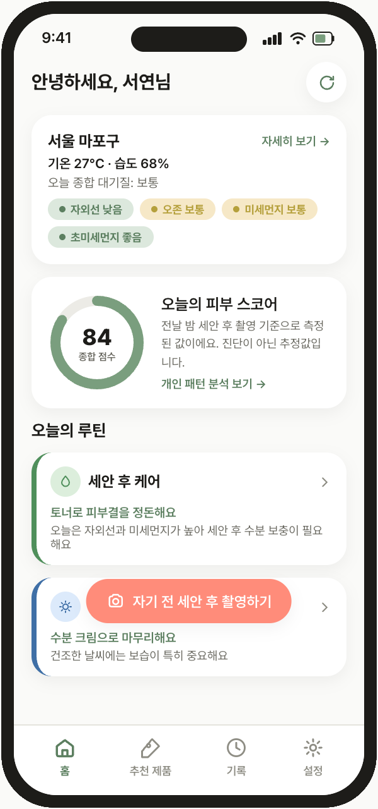
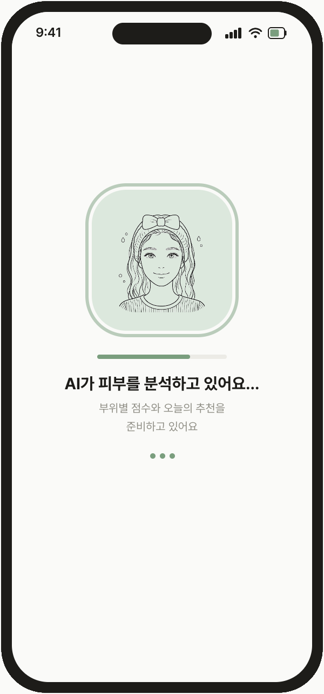
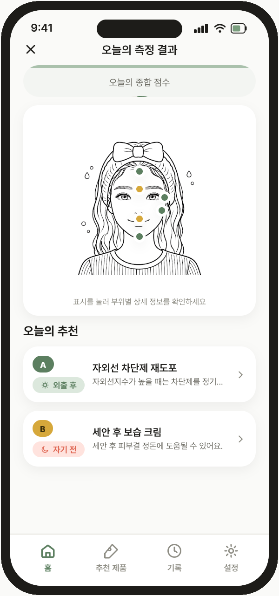
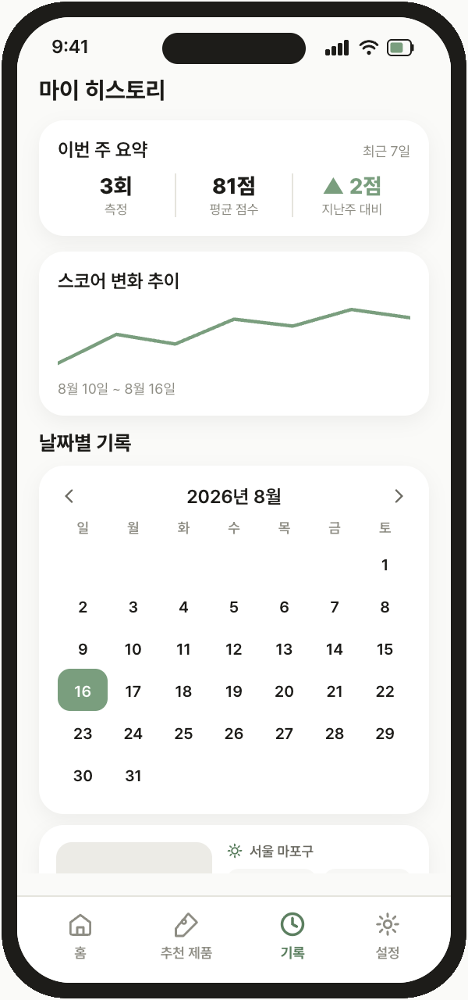
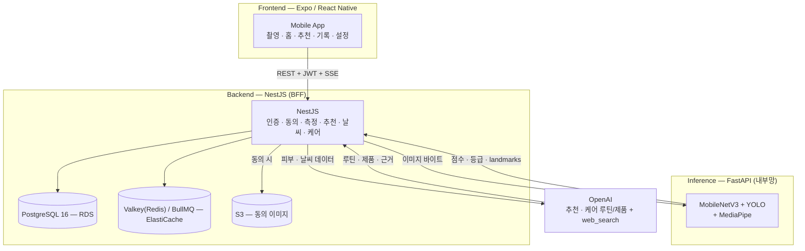

<p align="center">
  
</p>

<h1 align="center">Todayskin</h1>

<p align="center"><b>오늘의 피부를 AI로 이해하다</b></p>

<p align="center">
  날씨·대기질과 AI 피부 진단을 결합해 오늘의 피부 상태를 확인하고, 실제 화장품 기반의 스킨케어를 추천합니다.
  <br/>
  촬영한 얼굴과 그날의 UV·미세먼지·기온/습도를 함께 분석해 <b>근거 있는 추천</b>과 기록·패턴을 제공합니다.
</p>

<p align="center">
  
  
  
  
</p>

---

## 🚀 지금 바로 사용해 보세요

이 프로젝트는 **현재 AWS에 실제 배포되어 운영 중**입니다. 아래 링크로 바로 체험할 수 있습니다.

| 항목 | 방법 |
|---|---|
| **Android 앱 설치** | [랜딩 페이지](https://todayskin.pages.dev/)에서 APK 다운로드 (아래 QR 스캔 가능) |
| **심사용 테스트 계정** | 휴대폰 번호 `010-0000-0000` · OTP 인증번호 `123456` (데모 기간 8/26까지 유효, 진단 기록 8건 포함) |
| **백엔드 상태 확인** | [서비스 health](http://todayskin-alb-121101407.ap-northeast-2.elb.amazonaws.com/health) · [readiness](http://todayskin-alb-121101407.ap-northeast-2.elb.amazonaws.com/health/ready) |

<p align="center">
  <a href="https://todayskin.pages.dev/"></a>
  <br/>
  <a href="https://todayskin.pages.dev/">https://todayskin.pages.dev/</a>
</p>

---

이 저장소는 **프론트 · 백엔드 · 프로젝트 매니저(PM)** 가 한곳에서 협업하는 모노레포이며,
**AWS ECS Fargate(ap-northeast-2)에 실제 배포되어 운영 중**입니다.

<p align="center"><b>Frontend</b></p>
<p align="center">
  <a href="https://docs.expo.dev/versions/v54.0.0/"></a>
  <a href="https://reactnative.dev/"></a>
  <a href="https://docs.expo.dev/router/introduction/"></a>
</p>
<p align="center"><b>Backend</b></p>
<p align="center">
  <a href="https://nestjs.com/"></a>
  <a href="https://www.prisma.io/"></a>
  <a href="https://www.postgresql.org/"></a>
  <a href="https://fastapi.tiangolo.com/"></a>
</p>
<p align="center">
  <a href="https://redis.io/"></a>
  <a href="https://valkey.io/"></a>
  <a href="https://docs.bullmq.io/"></a>
  <a href="https://aws.amazon.com/ko/fargate/"></a>
  <a href="https://github.com/features/actions"></a>
</p>

---

## 제품이 하는 일

| 영역 | 사용자 경험 |
|------|-------------|
| 온보딩 · 계정 | 전화+OTP, 카카오/구글/애플 소셜, 동의·위치 |
| 홈 · 날씨 | 현재 기상·대기질·기온/습도, 측정 불가 시 명시적 unavailable |
| 측정 | 카메라 가이드 → 부위별 점수 · 결과 화면 (품질 게이트: 흐림/어두움/저해상도 거부) |
| 추천 · 제품 | **실제 화장품** + 구매 링크, 빠른 응답 후 AI 결과로 갱신 |
| 케어 루틴 | 날씨/피부/복합/아침 기반 2단계 루틴 + 카테고리별 실제 제품(근거 링크 포함) |
| 기록 · 패턴 | 날짜별 히스토리, 랜드마크(동의 시), 개인 패턴 |
| 설정 | 프로필 · 동의 · 알림 선호 · 탈퇴 |

> 얼굴 이미지는 **저장 동의한 경우만** 암호화 보관합니다. 미동의면 추론 후 보관하지 않습니다.
> 추천·케어의 출처는 검증 가능한 실제 참조(레지스트리)만 사용하며, 없는 인용을 만들지 않습니다.

---

## 프로젝트 하이라이트

| | 내용 |
|---|---|
| **실서비스 수준 운영** | AWS에 실제 배포·가동 중 — ECS Fargate + RDS + ElastiCache + S3 + Secrets Manager + OIDC CI/CD. 롤백 절차·장애 런북까지 문서화 |
| **AI 추론 서버 분리** | FastAPI가 점수·등급·랜드마크만 반환, 비즈니스 로직은 NestJS 전담 — 확장 가능한 2-tier 아키텍처 |
| **실제 화장품만 추천** | 허구 상품·목업 결과 금지. 시드 카탈로그 34개 실제품 + 검증된 구매 링크 + 근거 출처 레지스트리 |
| **프라이버시 우선 설계** | 얼굴 이미지는 동의 시에만 암호화 저장, 미동의 시 추론 후 즉시 폐기. 감사 로그·동의 게이트 |
| **테스트 문화** | 프론트 181 + 백엔드 645 테스트. 계약 드리프트·취약점(npm audit)·보안 경계값을 CI가 강제 |
| **UX 완성도** | SSE 실시간 job 상태, 캐시 즉시 응답 + AI 갱신, 품질 게이트(흐림/어두움 거부), 오프라인 대응 |

---

## 기술 스택

### Frontend — Expo/React Native 앱

| 영역&nbsp;&nbsp;&nbsp;&nbsp;&nbsp;&nbsp;&nbsp;&nbsp;| 사용 기술 |
|---|---|
| 런타임&nbsp;&nbsp;&nbsp;&nbsp;&nbsp;&nbsp;&nbsp;&nbsp;| **Expo SDK 54** · **React Native 0.81** · **React 19** · **TypeScript** |
| 라우팅 · UI&nbsp;&nbsp;&nbsp;&nbsp;&nbsp;&nbsp;&nbsp;&nbsp;| **Expo Router 6** · React Navigation(네이티브 스택/탭) · **Reanimated 4** + Worklets · react-native-svg · Safe Area Context · Screens · Splash Screen · System UI · Status Bar |
| 디바이스&nbsp;&nbsp;&nbsp;&nbsp;&nbsp;&nbsp;&nbsp;&nbsp;| expo-camera(촬영) · expo-image-picker(사진첩) · **expo-image-manipulator**(업로드 전 리사이즈) · expo-location(날씨 좌표) · expo-notifications(로컬 리마인더) · expo-network · expo-linking · expo-web-browser |
| 인증 · 저장&nbsp;&nbsp;&nbsp;&nbsp;&nbsp;&nbsp;&nbsp;&nbsp;| expo-auth-session(소셜 OAuth) · expo-crypto(Apple nonce) · expo-apple-authentication · **expo-secure-store**(토큰, 웹 AsyncStorage 폴백) · AsyncStorage |
| 아이콘 · 폰트&nbsp;&nbsp;&nbsp;&nbsp;&nbsp;&nbsp;&nbsp;&nbsp;| @expo/vector-icons · expo-font · **Pretendard**(브랜드 폰트) |
| 웹&nbsp;&nbsp;&nbsp;&nbsp;&nbsp;&nbsp;&nbsp;&nbsp;| react-native-web · react-dom (Expo 웹 빌드 가능) |
| 빌드 · 배포&nbsp;&nbsp;&nbsp;&nbsp;&nbsp;&nbsp;&nbsp;&nbsp;| **EAS Build** (시연용 APK, `preview` 프로파일) |

경로: `app/` (화면 — Expo Router 파일 기반) · `src/` (API client · 컴포넌트 · 훅 · 타입 · 테마)

### Backend — NestJS Modular Monolith (BFF + 비즈니스 로직)

| 영역&nbsp;&nbsp;&nbsp;&nbsp;&nbsp;&nbsp;&nbsp;&nbsp;| 사용 기술 |
|---|---|
| 서버&nbsp;&nbsp;&nbsp;&nbsp;&nbsp;&nbsp;&nbsp;&nbsp;| **NestJS 11** · Express · Modular Monolith(auth·otp·diagnosis·recommendation·care·weather·pattern·consent·storage·jobs·idempotency…) |
| 데이터&nbsp;&nbsp;&nbsp;&nbsp;&nbsp;&nbsp;&nbsp;&nbsp;| **PostgreSQL 16** · **Prisma 7** (`@prisma/adapter-pg`) · `pg` |
| 캐시 · 큐&nbsp;&nbsp;&nbsp;&nbsp;&nbsp;&nbsp;&nbsp;&nbsp;| **Redis**(프로토콜) · **Valkey**(운영 ElastiCache, Redis 호환) — ioredis · **BullMQ** (+ `@nestjs/bullmq`) — Redis 없으면 Inline dispatcher 폴백 |
| 인증&nbsp;&nbsp;&nbsp;&nbsp;&nbsp;&nbsp;&nbsp;&nbsp;| **JWT** access/refresh(회전·재사용 탐지·해시 저장) · **Passport** · **OTP**(OCTOMO MO 문자 수신 검증) · 소셜(Kakao/Google/Apple) 토큰 검증 |
| 검증 · 보안&nbsp;&nbsp;&nbsp;&nbsp;&nbsp;&nbsp;&nbsp;&nbsp;| class-validator · class-transformer · **Helmet** · **Throttler**(Redis 분산 rate limit, 민감 라우트 fail-closed) · Joi env 검증 |
| AI 연동&nbsp;&nbsp;&nbsp;&nbsp;&nbsp;&nbsp;&nbsp;&nbsp;| **OpenAI** — Chat Completions(strict json_schema, 추천/제품) · Responses API + `web_search`(케어 루틴/제품, 근거 검증) |
| 실시간&nbsp;&nbsp;&nbsp;&nbsp;&nbsp;&nbsp;&nbsp;&nbsp;| REST · **SSE** (`GET /jobs/:id/events` — BullMQ job 상태 실시간) |
| 저장소&nbsp;&nbsp;&nbsp;&nbsp;&nbsp;&nbsp;&nbsp;&nbsp;| **AWS S3** (`@aws-sdk/client-s3` · presigner) — 동의 이미지 암호화 저장 |
| 관측&nbsp;&nbsp;&nbsp;&nbsp;&nbsp;&nbsp;&nbsp;&nbsp;| **Pino**(nestjs-pino, 구조화 JSON 로그) · correlationId · 민감정보 redact · Sentry(선택) |
| API 문서&nbsp;&nbsp;&nbsp;&nbsp;&nbsp;&nbsp;&nbsp;&nbsp;| **Swagger/OpenAPI** (@nestjs/swagger) — 계약 드리프트 CI 검사 + 프론트 타입 자동 생성 |
| 좌표 변환&nbsp;&nbsp;&nbsp;&nbsp;&nbsp;&nbsp;&nbsp;&nbsp;| proj4 (위경도→기상청 격자) |

경로: `backend/src/` — 구조 지도는 [`backend/README.md`](backend/README.md)

### AI — FastAPI 독립 추론 서버

| 영역&nbsp;&nbsp;&nbsp;&nbsp;&nbsp;&nbsp;&nbsp;&nbsp;| 사용 기술 |
|---|---|
| 서버&nbsp;&nbsp;&nbsp;&nbsp;&nbsp;&nbsp;&nbsp;&nbsp;| **FastAPI** · Uvicorn · python-multipart (`backend/inference-service/`) |
| 모델&nbsp;&nbsp;&nbsp;&nbsp;&nbsp;&nbsp;&nbsp;&nbsp;| **PyTorch 2.9** · TorchVision — MobileNetV3(피부 점수) · **Ultralytics YOLO**(여드름 병변) · **MediaPipe**(랜드마크) |
| 이미지&nbsp;&nbsp;&nbsp;&nbsp;&nbsp;&nbsp;&nbsp;&nbsp;| OpenCV(headless) · Pillow · NumPy |
| 품질 게이트&nbsp;&nbsp;&nbsp;&nbsp;&nbsp;&nbsp;&nbsp;&nbsp;| 최소 해상도·휘도·Laplacian blur 검사 → 422 + 사유 코드 (N49) |
| 경계&nbsp;&nbsp;&nbsp;&nbsp;&nbsp;&nbsp;&nbsp;&nbsp;| 점수·등급·랜드마크만 반환 · **DB/인증/비즈니스 로직 없음** |

NestJS가 호출하고 결과를 영속화합니다. 원칙: [`docs/architecture/ARCHITECTURE.md`](docs/architecture/ARCHITECTURE.md)

### 테스트

| 영역&nbsp;&nbsp;&nbsp;&nbsp;&nbsp;&nbsp;&nbsp;&nbsp;| 내용 |
|---|---|
| 프론트&nbsp;&nbsp;&nbsp;&nbsp;&nbsp;&nbsp;&nbsp;&nbsp;| Jest + React Native Testing Library · **181 tests** (typecheck + lint 포함) |
| 백엔드&nbsp;&nbsp;&nbsp;&nbsp;&nbsp;&nbsp;&nbsp;&nbsp;| Jest (unit + e2e) · **645 tests** — 계약·보안·소유권·경계값 커버 |
| CI&nbsp;&nbsp;&nbsp;&nbsp;&nbsp;&nbsp;&nbsp;&nbsp;| GitHub Actions — PR마다 typecheck·lint·test·E2E(PostgreSQL) · `npm audit`(high 이상 차단) · OpenAPI drift 검사 |

### 인프라 — AWS 실배포 (2026-08-16)

| 영역&nbsp;&nbsp;&nbsp;&nbsp;&nbsp;&nbsp;&nbsp;&nbsp;| 사용 기술 |
|---|---|
| 컴퓨팅&nbsp;&nbsp;&nbsp;&nbsp;&nbsp;&nbsp;&nbsp;&nbsp;| **ECS Fargate** (NestJS + FastAPI 각각) · 비-root 실행 · graceful shutdown |
| 네트워크&nbsp;&nbsp;&nbsp;&nbsp;&nbsp;&nbsp;&nbsp;&nbsp;| **ALB** · VPC · Security Groups(내부망 inference) · **Cloud Map** 서비스 디스커버리(`inference.todayskin.local`) |
| 데이터&nbsp;&nbsp;&nbsp;&nbsp;&nbsp;&nbsp;&nbsp;&nbsp;| **RDS PostgreSQL 16** · **ElastiCache Valkey**(Redis 호환, `noeviction` 파라미터 그룹) · **S3** |
| 시크릿 · 관측&nbsp;&nbsp;&nbsp;&nbsp;&nbsp;&nbsp;&nbsp;&nbsp;| **Secrets Manager**(13종) · **CloudWatch** 로그 그룹 · 장애 런북 |
| CI/CD&nbsp;&nbsp;&nbsp;&nbsp;&nbsp;&nbsp;&nbsp;&nbsp;| **GitHub Actions OIDC** → ECR → 승인 게이트 → migrate → rollout · 롤백 절차 |
| 가이드&nbsp;&nbsp;&nbsp;&nbsp;&nbsp;&nbsp;&nbsp;&nbsp;| [`docs/guides/DEPLOYMENT.md`](docs/guides/DEPLOYMENT.md) |

---

## 시스템 한눈에



---

## 진행 상태

| | 상태 |
|---|---|
| 백엔드 MVP · 운영 기반 (T0~T14, N0~N22) | 완료 |
| 실제품 · 추천 빠른 경로 · 소셜 · 설정 계약 (N24~N34) | 완료 · **API freeze** |
| 프론트 제품 웨이브 (F0~F70) | **완료** (OTP MO, 캘린더, SSE, 실기기 대응 — Task 보드 기준) |
| 리팩토링 R1~R35 (배치 B1~B6) | **완료** (2026-08-12) |
| Fable5 리뷰 대응 — 보안·품질 게이트·기온/습도 (F72~F78 · N46~N49 · N53) | **완료** (2026-08-13) |
| 배포 준비 웨이브 — 실험실 옵트인·주간 요약·측정 신뢰·상태 완성도·Pretendard·배포 스모크 (F79~F83 · N54) | **완료** (2026-08-13) |
| LLM 프로바이더 전환(Gemini→OpenAI) · 케어 루틴/제품 카테고리 신설(`care` 모듈, 카테고리별 그리드 UI) | **완료** (2026-08-14) |
| AWS 실배포 (N16, 2026-08-16) | **완료** — ECS Fargate(backend+inference)·RDS PG16·ElastiCache·S3·Secrets Manager·OIDC CD 가동 중. 접속: `http://todayskin-alb-121101407.ap-northeast-2.elb.amazonaws.com`, 랜딩: https://todayskin.pages.dev/ |
| 데모 준비 (2026-08-17) — 시연용 Android APK(EAS), 소셜 로그인 네이티브 대비(구글 다중 aud), 로그인/가입 OTP 훅 통일 | **완료** — APK 빌드·구글 웹/Android 클라이언트 ID 발급·백엔드 시크릿 반영. 카카오는 콘솔 리다이렉트 제약으로 보류(데모는 구글+OTP) |
| EAS 스토어 제출 · 구독 결제 · Sentry | 보류 (해커톤 범위 밖 — 데모는 APK/Expo Go로 진행) |

---

## 빠른 시작

```bash
git clone https://github.com/jae-ho93/Todayskin.git
cd Todayskin
```

전체 로컬 실행(앱 + API + DB)은 **[`docs/guides/SETUP.md`](docs/guides/SETUP.md)** 한 문서를 따릅니다.

```bash
# 프론트 (루트)
cp .env.example .env && npm install && npm start

# 프론트 검사 (CI와 동일)
npm run typecheck && npm run lint && npm test

# 백엔드 (별도 터미널)
cd backend && cp .env.example .env && npm install
docker compose up -d
npm run prisma:generate && npm run prisma:migrate && npm run prisma:seed
npm run start:dev
```

---

## 저장소 구조

```text
Todayskin/
├─ README.md · CONTRIBUTING.md     # GitHub 대문 · 협업 규칙
├─ app/ · src/                     # Expo 앱
├─ docs/                           # 문서 허브 → docs/README.md
│  ├─ architecture/                # ARCHITECTURE.md (시스템 원칙)
│  ├─ guides/                      # SETUP.md · DEPLOYMENT.md
│  ├─ tasks/                       # FRONTEND_TASKS · BACKEND_TASKS · BACKEND_ARCHIVE · REFACTORING_BACKLOG
│  └─ reviews/                     # ProjectReview_2026-08-13.md (완료)
├─ backend/                        # NestJS + inference-service
│  ├─ README.md                    # 모듈·디렉터리 구조 지도
│  ├─ src/ · prisma/ · test/
│  ├─ inference-service/
│  └─ docker/                      # Compose · ECS task JSON (배포 본문은 docs/guides/DEPLOYMENT.md)
└─ ml/                             # 모델 학습 계획
```

## 문서 지도

전체 목록: **[docs/README.md](docs/README.md)**

| 역할 | 먼저 읽을 것 |
|------|----------------|
| 누구나 / 새로 합류 | 이 README → [SETUP](docs/guides/SETUP.md) → [CONTRIBUTING](CONTRIBUTING.md) |
| 프론트 | [FRONTEND_TASKS](docs/tasks/FRONTEND_TASKS.md) · `app/`, `src/` |
| 백엔드 | [ARCHITECTURE](docs/architecture/ARCHITECTURE.md) · [backend/README](backend/README.md) · [BACKEND_TASKS](docs/tasks/BACKEND_TASKS.md) · [BACKEND_ARCHIVE](docs/tasks/BACKEND_ARCHIVE.md) · [REFACTORING_BACKLOG](docs/tasks/REFACTORING_BACKLOG.md) |
| 프로젝트 매니저 (PM) | FE/BE Task 보드 · CONTRIBUTING |
| 인프라 | [DEPLOYMENT](docs/guides/DEPLOYMENT.md) |

---

<p align="center"><sub>Todayskin — weather-aware skincare, built by FE · BE · Project Manager together</sub></p>
