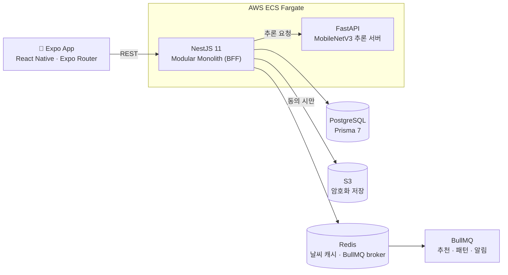

# Todayskin

날씨·대기질과 피부 이미지 분석을 결합해 피부 상태와 스킨케어 추천을 제공하는 Expo 모바일 애플리케이션.

  
  
  
  
  

  
  
  
  
  

  
  
  

---

## 개요

**NestJS가 인증·동의·진단·추천·날씨·데이터 영속화**를 담당하고, **FastAPI는 이미지 추론 결과만 반환**한다. 동의한 진단 이미지만 S3에 암호화 저장하며, 미동의 이미지는 추론 후 즉시 삭제한다.

## 구성

| 레이어 | 스택 | 역할 |
|---|---|---|
| 프론트엔드 | Expo SDK 54 · React Native · Expo Router | 온보딩, 촬영, 진단 결과, 추천, 히스토리 UI |
| 메인 백엔드 | NestJS 11 Modular Monolith · Prisma 7 · PostgreSQL | 인증·OTP·동의·진단·추천·날씨·데이터 영속화 |
| AI 추론 | `backend/inference-service/` FastAPI + MobileNetV3 | 이미지 → 부위별 등급/수치 추론 결과만 반환 |
| 비동기·캐시 | Redis · BullMQ | 날씨 캐시, 추천/패턴/알림 비동기 처리 |
| 운영 | AWS ECS Fargate · RDS · S3 · CloudWatch · GitHub Actions | CI → ECR → Fargate 배포 |

## 진행 상태

- ✅ **T0~T14** — 초기 구조(NestJS/Prisma/인증/진단/추천 등 MVP 기능) 완료
- ✅ **N0~N8** — 운영 보안, 구조화 로깅, S3+동의 연동, BullMQ, ECS 배포, Soft Delete, 레거시 FastAPI 정리, 히스토리 캘린더까지 완료
- ⏳ **N9 이후** — 운영 공개 전 후속 작업. 특히:
  - 실제 SMS OTP 게이트웨이 연결 (현재는 개발용 Mock OTP만 동작)
  - AWS 운영 리소스 프로비저닝 및 첫 배포

## 문서

- [전체 설치 가이드](docs/SETUP.md)
- [온보딩](docs/ONBOARDING.md)
- [백엔드 아키텍처](docs/ARCHITECTURE.md)
- [백엔드 실행과 API 개요](backend/README.md)
- [백엔드 작업 현황과 다음 과정](backend/BACKEND_TASKS.md)
- [설계 결정](backend/decision.md)
- [협업 규칙](CONTRIBUTING.md)

## 관련 저장소

- Todayskin Skin-AI (준비 중) — `backend/inference-service/`가 서빙하는 피부 진단 모델(백본 비교실험, 학습 파이프라인) 전용 저장소

---

날씨 × 피부 데이터를 결합한 개인 맞춤 스킨케어 추천 서비스

